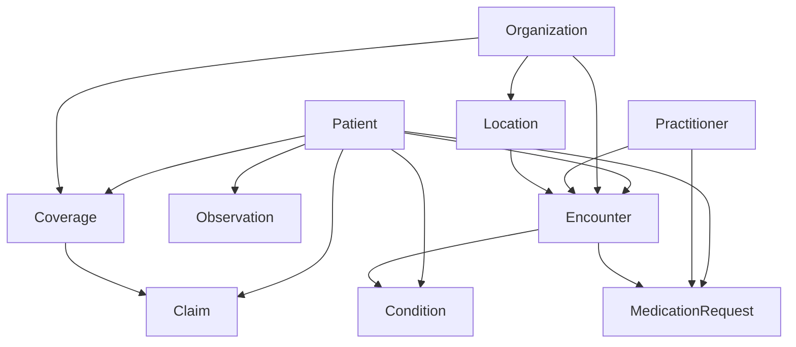

# Developer Guide: Adding Resources & Referential Integrity

This guide explains how to extend SynthFHIR with new resources and ensure they maintain referential integrity with existing data.

## 1. Adding a New Resource

### Step A: Add DDL Schema
Create a new `.sql` file in the `ddl/` directory. Use standard Snowflake syntax.
- **File**: `ddl/my_new_resource.sql`
- **Rule**: Ensure an `ID` column exists (32-character string).

### Step B: Update the Template Generator
The LLM uses "Golden Templates" to understand the data structure. You should update `utils/template_generator.py` to support the new resource.
1. Add a `generate_mock_my_new_resource()` function.
2. Register it in the `generators` dictionary at the bottom of the file.
3. Run `python utils/template_generator.py` to create `templates/my_new_resource_golden.json`.

### Step C: Register in Configuration
Update `config/resources.py` to enable the resource.
```python
"my_new_resource": {
    "enabled": True,
    "display_name": "My New Resource",
    "ddl_file": str(DDL_DIR / "my_new_resource.sql"),
    "template_file": str(TEMPLATES_DIR / "my_new_resource_golden.json"),
    "exclude_columns": STANDARD_EXCLUDES,
    "relationships": [
        {"column": "PATIENT_REF", "references": "patient.ID"}
    ],
}
```

### Step D: Reindex RAG
Open the application and click **"🔄 Reindex Documents"** in the sidebar. This ensures the LLM can find your new DDL schema during generation.

---

## 2. Implementing Referential Integrity

### How it Works
The system uses a **Stateful Relationship Context**. When generating multiple resources (e.g., Patient then Claim):
1. **ID Tracking**: `TableGenerator` captures the IDs of the first resource (e.g., Patient).
2. **Context Injection**: These IDs are injected into the prompt of the second resource (e.g., Claim) as a list of available references.
3. **LLM Instruction**: The `PromptBuilder` tells the LLM: *"Use these IDs for the PATIENT field."*

### Best Practices for Linking
- **Order Matters**: Always list the "Parent" resource (e.g., Patient) before the "Child" resource (e.g., Claim) in your generation request.
- **Reference Format**: In your Golden Template, show the format clearly: `"REFERENCE": "Patient/3f987ee0..."`.
- **Relationship Meta**: Keep the `relationships` list in `config/resources.py` accurate for future automated validation features.
---

## 3. Planning Referential Integrity

To maintain a consistent clinical story, you must plan the "order of operations."

### Resource Dependency Map
The following diagram shows how resources typically relate to each other. When generating data, you should follow this hierarchy down.



### Strategic Generation Order
When using the "Generate" tab, list your resources in the following priority order:

1.  **Level 1 (Masters)**: `organization`, `practitioner`, `location`
2.  **Level 2 (Demographics)**: `patient`
3.  **Level 3 (Administrative)**: `coverage`, `encounter`
4.  **Level 4 (Clinical/Financial)**: `observation`, `condition`, `claim`, `medication_request`

**Example Prompt Order:**
`["organization", "patient", "encounter", "condition"]`

### Complex Relationship Logic
If a resource has multiple references (e.g., `MedicationRequest` needs both `Patient` and `Practitioner`), the system will inject lists for BOTH:
- `PATIENT IDs: [id1, id2, ...]`
- `PRACTITIONER IDs: [prac1, prac2, ...]`

The LLM is instruction-tuned to pick one from each list to populate the `SUBJECT` and `REQUESTER` fields respectively.
---

## 4. Troubleshooting Missing Data

If specific columns are missing from your output CSVs, follow this checklist to identify and fix the issue.

### A. Check Exclusions (`config/resources.py`)
Ensure the column is not listed in `STANDARD_EXCLUDES` or the resource's `exclude_columns` list. The generator ignores these columns by design.

### B. Update the Golden Template (`templates/*.json`)
The LLM heavily relies on the "Golden Templates" for its output structure. 
- **Action**: Add the missing column to your `*_golden.json` file with a realistic sample value. This is the most reliable way to enforce population.

### C. Add Knowledge Rules (`knowledge/`)
If a column requires complex logic or is frequently skipped, add a specific instruction in the resource's knowledge folder (e.g., `knowledge/claim/rules.txt`).
- **Example**: "Every claim record MUST have a valid PROVIDER_ID from the DDL."
- **Action**: Always click **"🔄 Reindex Documents"** after adding new rules.

### D. Verify DDL Synced
Ensure the column exists in the `.sql` file in the `ddl/` folder and that you have reindexed the documents.
